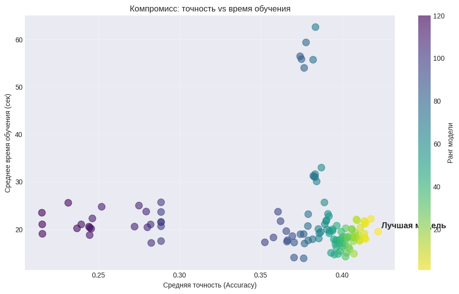
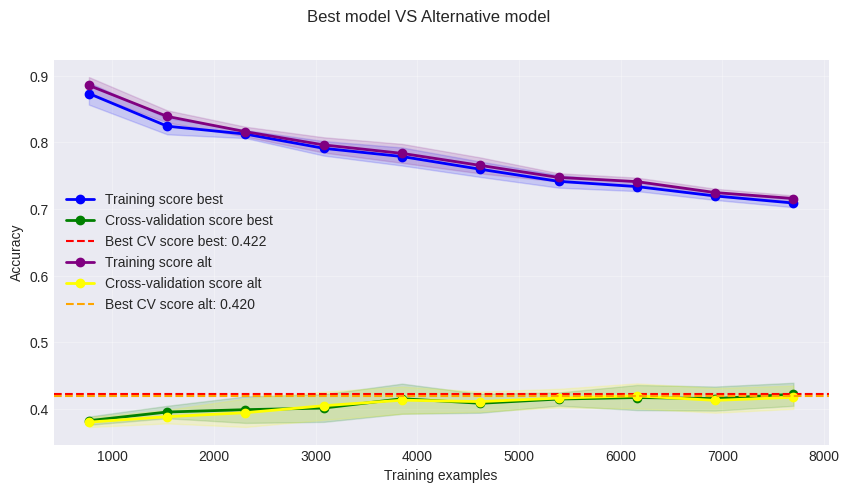
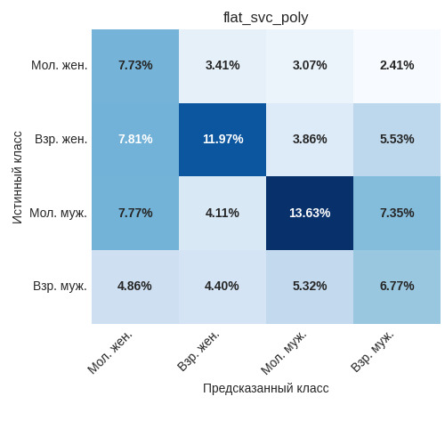

# Справедливая модель (flat_svc_poly)

## Назначение

Модель «Справедливая модель» представляет собой плоский классификатор на основе метода опорных векторов с полиномиальным ядром (poly), который одновременно предсказывает пол и возраст автора текста, объединяя их в четыре возможные категории:
- молодая женщина,
- взрослая женщина,
- молодой мужчина,
- взрослый мужчина.

Подходит для сценариев, где важна **равномерность качества предсказания по всем классам**. Полиномиальное ядро позволяет модели выявлять нелинейные зависимости в признаковом пространстве, при этом сохраняя лучшую интерпретируемость и стабильность по сравнению с RBF-версией. 

Модель демонстрирует наименьший разброс точности среди всех рассмотренных подходов на подвыборке пожилых авторов и высокую стабильность на коротких текстах, что делает её предпочтительным выбором для задач, требующих предсказуемости результатов.

## Особенности подготовки данных

Модель чувствительна к выбросам, мультиколлинеарности и масштабу признаков, поэтому этап предобработки включает:

- **Робастное масштабирование** (`RobustScaler`) для всех признаков – устойчиво к выбросам.  
- **Преобразование Йео–Джонсона** для приближения распределений к нормальному.  
- **Отбор признаков** с помощью `SelectKBest` (F-классификация) на каждом фолде кросс-валидации.

## Как обучалась модель

Целевая переменная формировалась как комбинация пола и возраста:  
`gender * 2 + age` (0 – молодая женщина, 1 – взрослая женщина, 2 – молодой мужчина, 3 – взрослый мужчина).

Оптимальные гиперпараметры найдены с помощью `GridSearchCV`:

- `C = 1` (штраф за ошибку)
- `kernel = 'poly'` (полиномиальное ядро)
- `degree = 3` (степень полинома)
- `class_weight = 'balanced'` (учёт дисбаланса классов)
- отбор признаков: `k = 21` (наиболее важные признаки)

Диаграмма рассеяния точности модели относительно скорости обучения показана ниже

На кросс-валидации модель достигла средней точности **42.2%**, что выше случайного базового уровня и сопоставимо с альтернативными конфигурациями.

Для оценки влияния отбора признаков была обучена альтернативная модель с теми же гиперпараметрами, но с использованием **всех признаков** (k = 'all'), которая показала результат **42.0%**. Таким образом, отбор 21 наиболее информативного признака даёт прирост около 0.2 процентного пункта, что подтверждает наличие шумовых признаков в данных.

**График обучения** демонстрирует интересную динамику: по мере увеличения доли обучающей выборки точность на обучающем множестве плавно снижалась с 0.90 до 0.75, в то время как точность на валидации неуклонно росла с 0.37 до итоговых 0.422. Такое поведение свидетельствует об отсутствии выраженного переобучения — модель стабильно обобщает, а увеличение объёма данных систематически улучшает её качество. Это отличает полиномиальное SVM от RBF-версии, которая демонстрировала более выраженное переобучение на начальных этапах.

## Результаты тестирования

| subsample | accuracy_mean | accuracy_std | f1_mean   | f1_std   |
|-----------|---------------|--------------|----------------|---------------
| long      | 0.3878        | 0.0337       | 0.3934    | 0.0291 |
| men       | 0.3762        | 0.0344       | 0.4675    | 0.0413 |
| old       | 0.3709        | 0.0433       | 0.4723    | 0.0477 |
| short     | 0.4139        | 0.0288       | 0.4189    | 0.0274 |
| women     | 0.4302        | 0.0343       | 0.5162    | 0.0367 |
| young     | 0.4316        | 0.0365       | 0.5269    | 0.0405 |

На общей выборке модель показывает **42.2% точности**, уступая универсальному оптимуму (45.0%), однако её ключевое преимущество раскрывается при анализе стабильности и равномерности предсказаний:

- **Наименьший разброс точности** среди всех моделей на подвыборке "old" (std = 0.0433) и одна из самых низких вариаций на "short" (std = 0.0288).
- **Лучшие результаты среди женщин и молодых авторов**: на подвыборке "women" точность составляет 43.0% (против 42.0% у RBF), на "young" — 43.2% (против 50.6% у RBF). Модель жертвует пиковыми значениями на доминирующем классе молодых мужчин в пользу более сбалансированного распознавания остальных групп.
- Коэффициент вариации (CV) модели составляет около **10.5%**, что является одним из лучших показателей среди всех рассмотренных подходов. Для сравнения: у универсального оптимума CV = 11.71%, у линейного SVM — 12.82%. Это означает, что «Справедливая модель» демонстрирует минимальный разброс точности при варьировании данных и её результаты наиболее предсказуемы на новых выборках.

Матрица ошибок показана на рисунке ниже

Диагональные элементы (правильные предсказания) суммируются примерно в **40.1%**, что несколько ниже, чем у RBF-версии, однако распределение правильных ответов по классам значительно равномернее:

- Молодые мужчины по-прежнему распознаются лучше всего (13.63%, полнота ~41% внутри класса), но их доминирование уже не столь подавляющее.
- Взрослые женщины показывают хороший результат (11.97%, полнота ~41%).
- Молодые женщины получают 7.73% (полнота ~42%), что более чем вдвое выше, чем у RBF-модели!
- Взрослые мужчины — 6.77% (полнота ~32%), также существенный прогресс по сравнению с RBF (3.78%).

Основные паттерны ошибок:
- Молодые женщины чаще всего путаются со взрослыми женщинами (7.81%) и молодыми мужчинами (7.77%) — гендерная граница размыта примерно одинаково в обе стороны.
- Взрослые женщины ошибочно классифицируются преимущественно как молодые женщины (7.81%) и, в меньшей степени, как молодые мужчины (4.11%).
- Молодые мужчины в заметной части случаев попадают в категорию взрослых мужчин (7.35%) и взрослых женщин (3.86%).
- Взрослые мужчины ошибочно определяются как молодые мужчины (5.32%) и взрослые женщины (4.40%).

Важно отметить, что ошибки распределены более равномерно между классами, нет катастрофического провала ни по одной из групп. Это подтверждает название модели — «Справедливая»: она не приносит отдельные классы в жертву общей точности.

## Рекомендации по применению

Эта модель рекомендуется в качестве основного решения, если:

- **Важна равномерная классификация всех четырёх групп** — например, в задачах, где требуется одинаково хорошо распознавать и мужчин, и женщин, и молодых, и пожилых авторов. Модель существенно лучше справляется с молодыми женщинами и взрослыми мужчинами по сравнению с RBF-версией.
- **Приоритетом является стабильность и предсказуемость** — модель демонстрирует наименьший разброс точности на ключевых подвыборках и один из лучших коэффициентов вариации. Если важно, чтобы качество не "плавало" от выборки к выборке, полиномиальное SVM — оптимальный выбор.
- **Преобладают женская аудитория или пожилые авторы** — на этих группах модель показывает лучшие или сопоставимые результаты.
- **Тексты короткие** — на подвыборке "short" модель имеет точность 41.4% с минимальным стандартным отклонением (0.029), что делает её самым надёжным вариантом для коротких сообщений.

Ограничения: модель уступает универсальному оптимуму в точности на общей выборке и на доминирующем классе молодых мужчин. В задачах, где **критически важна максимальная общая точность** и допустим перекос в сторону мужской молодёжной аудитории, лучше использовать `flat_svc_rbf`. Если же требуется баланс и справедливость — выбор однозначно в пользу полиномиальной версии.