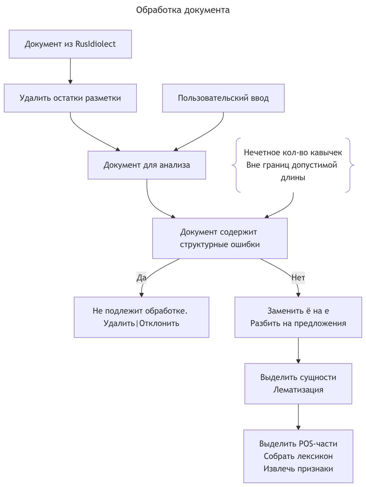
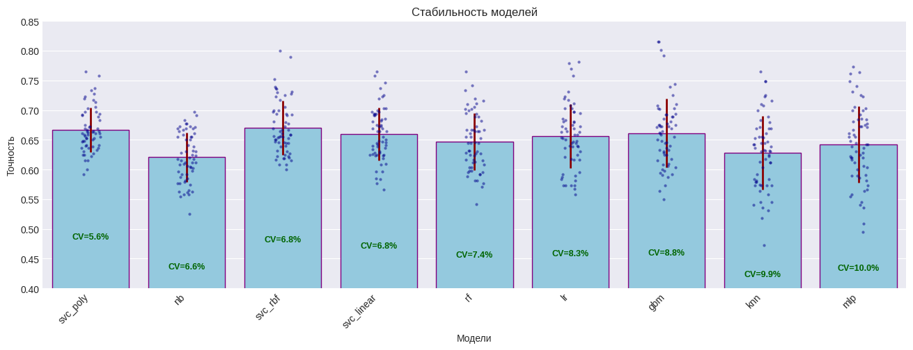
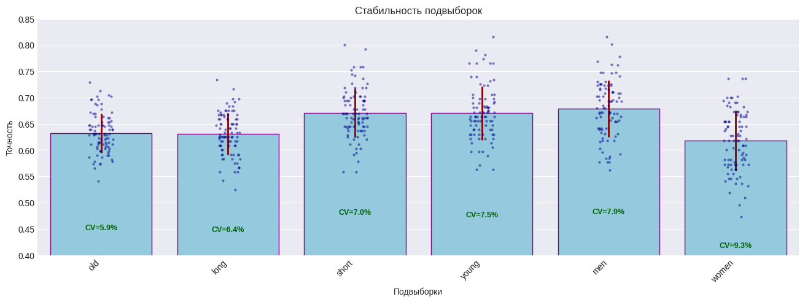
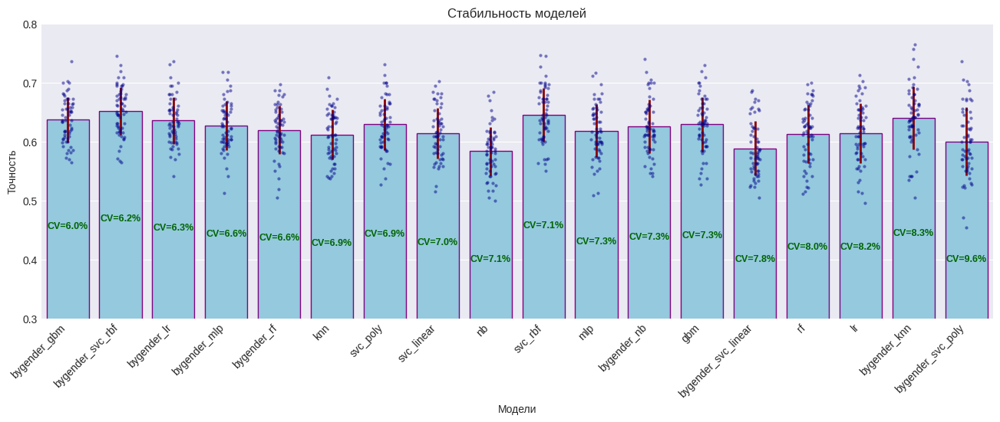
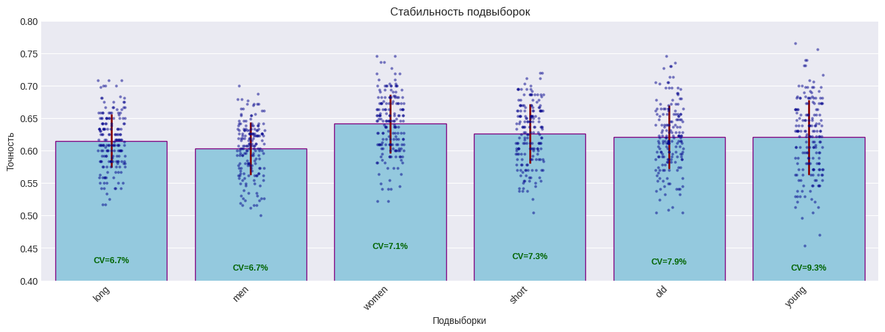
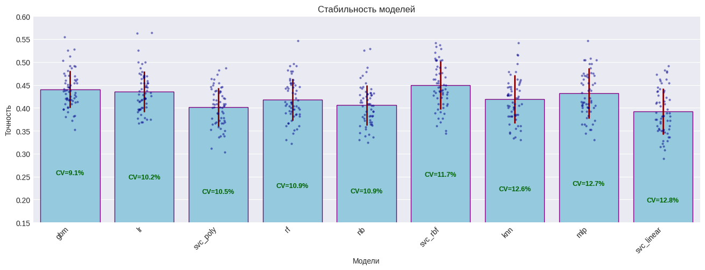
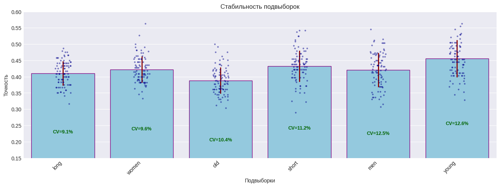
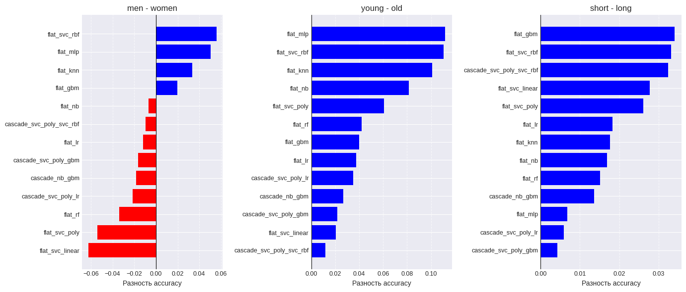
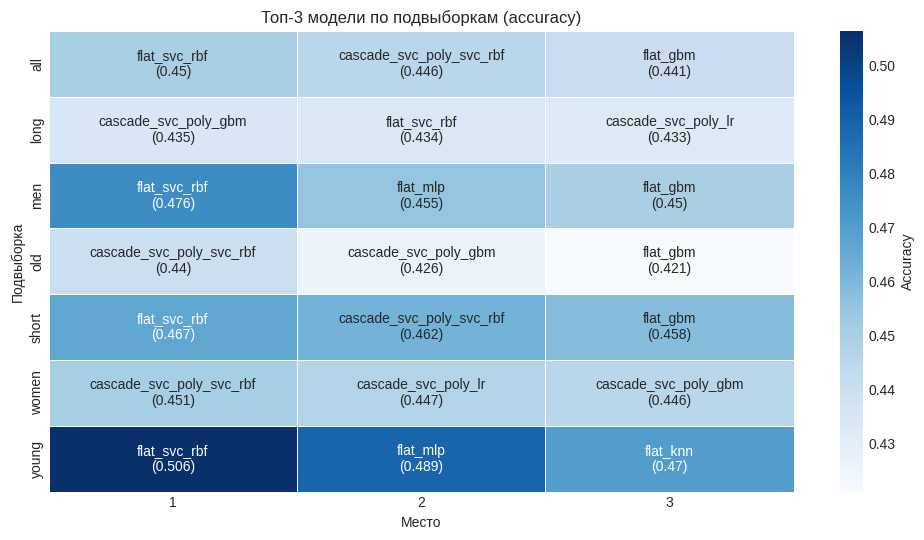

# Автоматическое профилирование автора текста: определение пола и возраста

## 1. Введение

Автоматическое профилирование автора текста - это задача определения демографических характеристик человека (пол, возраст) на основе анализа его письменной речи. Она востребована в таких областях, как таргетинг рекламы, рекомендательные системы, судебная лингвистика, анализ аудитории социальных сетей. В основе подхода лежит гипотеза о том, что стиль письма содержит устойчивые маркеры, коррелирующие с полом и возрастом автора.

## 2. Постановка задачи

Цель работы - построить и сравнить модели машинного обучения, способные по тексту на русском языке определить:

- **пол автора** (мужской / женский);
- **возрастную группу** (молодой ≤35 лет / взрослый >35 лет);
- **полный профиль** (комбинация пола и возраста: молодая женщина, взрослая женщина, молодой мужчина, взрослый мужчина).

## 3. Данные

В распоряжении имелся корпус текстов, размеченный по полу и возрасту. Тексты представляли собой посты, комментарии, сообщения из различных источников. Общий объём выборки составил несколько десятков тысяч документов. Для обучения и оценки использовалось стратифицированное разделение на обучающую, валидационную и тестовую выборки.

## 4. Признаковое описание текстов

Из каждого текста извлекались лингвистические признаки, объединённых в следующие группы:

- **Лексические**: доля редких слов, лексическое разнообразие (type-token ratio), размер лексикона, энтропия.
- **Морфологические**: частоты употребления частей речи (существительные, глаголы, прилагательные, местоимения и др.).
- **Синтаксические**: биграммы частей речи, средняя длина предложения, доля длинных предложений.
- **Пунктуационные**: частоты использования знаков препинания (запятая, точка, восклицательный/вопросительный знаки, кавычки, скобки и т.д.), широта пунктуационного репертуара.
- **Специализированные сущности**: частота упоминания дат, адресов, номеров телефонов, URL, смайлов и др.
- **Индексы формальности**: индекс Хейлингера, индекс Тулдавы.

Часть признаков с большим количеством нулевых значений была преобразована в бинарные флаги наличия или переведена в категории «типичности».

## 5. Модели и алгоритмы

### 5.1 Типы алгоритмов

Были выбраны 9 классов моделей, покрывающих различные подходы:

1. Случайный лес (Random Forest)
2. Градиентный бустинг (Gradient Boosting)
3. Логистическая регрессия (Logistic Regression)
4. Наивный байесовский классификатор (Naive Bayes)
5. Метод k-ближайших соседей (kNN)
6. Метод опорных векторов с линейным ядром (SVC linear)
7. Метод опорных векторов с полиномиальным ядром (SVC poly)
8. Метод опорных векторов с RBF-ядром (SVC rbf)
9. Многослойный персептрон (MLP)

### 5.2 Постановки задачи

Для каждого типа модели обучено 5 вариантов (всего 45 конфигураций):

- `gender` - бинарная классификация пола;
- `age` - бинарная классификация возрастной группы на всех данных;
- `age_male` - классификация возраста только среди мужчин;
- `age_female` - классификация возраста только среди женщин;
- `flat` - плоская четырёхклассовая классификация полного профиля.

## 6. Результаты экспериментов

### 6.1 Классификация пола

- **Точность**: лидируют модели семейства SVC. SVC с RBF-ядром обеспечивает наивысшую среднюю точность (~ на несколько п.п. выше остальных). SVC с полиномиальным ядром немного уступает в точности, но выигрывает в стабильности (минимальное std).
- **Стабильность**: наиболее устойчивы SVC-poly и наивный Байес (последний - с низкой точностью). Наибольший разброс у MLP и kNN.
- **Подвыборки**: наименьшая вариативность наблюдается на взрослых авторах, наибольшая - на женщинах. Минимальное std на разных подвыборках достигается разными моделями: GBM - для длинных текстов и женщин, SVC-poly - для мужчин и молодых, NB - для пожилых.
- Тест Левене не выявил статистически значимых различий дисперсий между подвыборками (p>0.05), что говорит об отсутствии систематической неоднородности.

### 6.2 Классификация возраста

Задача оказалась сложнее: точность ниже, чем для пола, что указывает на более слабый возрастной сигнал в признаках.

- Лучшие результаты показали SVC (RBF и poly) и градиентный бустинг.
- Специализированные модели, обученные отдельно для мужчин и женщин, в ряде случаев дают более стабильное поведение, чем общая модель возраста.
- Анализ подвыборок подтвердил, что молодые авторы классифицируются точнее, чем взрослые; длинные тексты - несколько лучше коротких.

### 6.3 Плоская классификация профиля (4 класса)

- **По общей точности** лидирует `flat_svc_rbf`. Эта модель максимально извлекает дискриминативную силу из признаков, но имеет перекос в сторону доминирующего класса (молодые мужчины).
- **Сбалансированность распознавания** (равномерная точность по всем четырём классам) лучше у `flat_svc_poly` и `flat_svc_linear`. Они ценой небольшой потери общей точности обеспечивают более справедливое предсказание для редких групп (молодые женщины, взрослые мужчины).
- **Каскадные схемы** (сначала определяется пол, затем возраст внутри пола) демонстрируют наилучший максиминный критерий - максимальную минимальную точность среди всех подвыборок. Это делает их предпочтительными, когда требуется гарантия качества на самых проблемных сегментах (например, на женщинах или коротких текстах).

### 6.4 Анализ ошибок и смещений

- Матрицы ошибок показывают систематическое смещение предсказаний в сторону класса «молодой мужчина», что объясняется его численным преобладанием в обучающей выборке.
- Женская подвыборка остаётся наиболее сложной как по стабильности, так и по точности; на ней модели чаще ошибаются, путая молодых женщин с молодыми мужчинами, а взрослых женщин - с молодыми мужчинами.
- Короткие тексты (менее 2000 символов) дают более высокую вариативность результатов, чем длинные, что связано с меньшим количеством информации для анализа.

## 7. Рекомендации по выбору модели

На основе проведённого анализа сформулированы практические рекомендации:

| Приоритет / Ситуация | Рекомендуемая модель |
|----------------------|----------------------|
| Максимальная общая точность на разнородных данных | `flat_svc_rbf` |
| Снижение смещения по полу/возрасту, улучшение качества на женщинах и взрослых | каскад `svc_poly → svc_rbf` (или `→ gbm`) |
| Справедливое распознавание редких классов (молодые женщины, взрослые мужчины) | `flat_svc_poly` или `flat_svc_linear` |
| Работа на коротких текстах | `flat_svc_rbf` или `flat_mlp` (после тюнинга) |
| Минимальная вариативность на длинных текстах или женской подвыборке | градиентный бустинг (GBM) |

## 8. Выводы

1. Используемые стилометрические признаки содержат статистически значимый, но слабый сигнал о поле и возрасте автора. Лучшие модели достигают точности, существенно превышающей случайную, однако абсолютные значения остаются умеренными, что ограничивает возможность точного предсказания в индивидуальных случаях.
2. Семейство методов опорных векторов (SVC) показало наилучшие результаты: RBF-ядро максимизирует точность, полиномиальное ядро обеспечивает стабильность и сбалансированность.
3. Каскадные схемы позволяют улучшить гарантированное качество на проблемных подвыборках за счёт разделения задачи на два последовательных этапа.
4. Основные источники ошибок - дисбаланс классов и слабая выраженность возрастных различий в текущем наборе признаков.
5. Дальнейшее улучшение качества профилирования должно идти по пути:
   - расширения признакового пространства (синтаксические и семантические эмбеддинги, учёт жанра и тематики);
   - применения методов компенсации дисбаланса (взвешивание классов, oversampling, аугментация);
   - ансамблирования нескольких сильных и сбалансированных моделей.

Разработанные модели и рекомендации могут быть использованы в прикладных системах, где требуется демографический анализ текстовой информации.