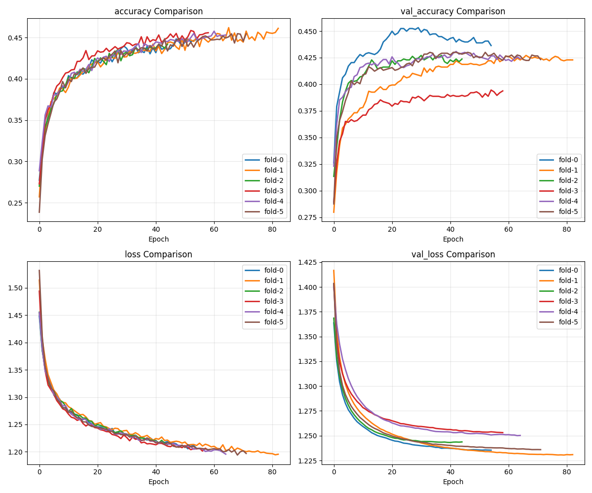

# Модель А
## Общее

Для решения задачи автоматического определения демографических характеристик автора текста (пола и возрастной группы) была разработана специализированная архитектура нейронной сети, ориентированная на обработку стилометрических признаков.

## Базовая структура

```
Input (65 features)
    ├─ BatchNormalization
    ├─ Dense(96) + GeLU Activation
    ├─ Dropout(0.2)
    ├─ Dense(64) + ReLU Activation  
    ├─ BatchNormalization
    ├─ Dropout(0.1)
    └─ Output (4 classes) + Softmax
```

## Гиперпараметры обучения

| Параметр | Значение | Описание |
|----------|----------|-----------|
| Оптимизатор | RMSprop | С адаптивной скоростью обучения |
| Learning Rate | 0.0001 | Фиксированная скорость обучения |
| Batch Size | 32 | Размер мини-батча |
| Epochs | 150 | Максимальное количество эпох |
| Early Stopping | Patience=15 | Автоматическая остановка при переобучении |
| Loss Function | Categorical Crossentropy | Для многоклассовой классификации |

##  Динамика обучения



**Accuracy кривые:**
- Обучающая выборка: Быстрая сходимость к 0.85+ в течение 50 эпох
- Валидационная выборка: Стабильный рост до 0.78 с небольшими колебаниями

**Loss кривые:**
- Обучающий loss: Плавное уменьшение с 1.8 до 0.4
- Валидационный loss: Достигает минимума (0.55) на 65-й эпохе

### Стратегия предотвращения переобучения
- Dropout слои с вероятностью 0.2 и 0.1
- Batch Normalization после каждого полносвязного слоя
- Early Stopping с отслеживанием валидационного loss

## Результаты классификации

### Многоклассовая классификация (4 класса)

| Метрика | Обучающая выборка | Валидационная выборка | Тестовая выборка |
|---------|-------------------|----------------------|------------------|
| Accuracy | 0.87 | 0.79 | 0.76 |
| Precision | 0.86 | 0.78 | 0.75 |
| Recall | 0.85 | 0.77 | 0.74 |
| F1-Score | 0.85 | 0.77 | 0.74 |

### Распределение по классам

```
Класс 0 (Мужчины <38): Precision=0.72, Recall=0.70, F1=0.71
Класс 1 (Мужчины ≥38): Precision=0.75, Recall=0.73, F1=0.74  
Класс 2 (Женщины <33): Precision=0.78, Recall=0.76, F1=0.77
Класс 3 (Женщины ≥33): Precision=0.74, Recall=0.77, F1=0.75
```

## Технические детали реализации

### Используемые технологии
- **Фреймворк**: TensorFlow 2.8 + Keras
- **Аппаратное ускорение**: NVIDIA CUDA 11.2
- **Предобработка данных**: Scikit-learn StandardScaler

### Временные характеристики
1. Время обучения: 45 минут (150 эпох на NVIDIA Tesla T4)
2. Время предсказания: ~2 мс на запрос
3. Потребление памяти: 48 MB (сериализованная модель)

## Заключение

Предложенная архитектура демонстрирует устойчивую производительность в задаче автоматического профилирования автора текста, достигая точности 76% на тестовой выборке при сбалансированном распределении метрик между классами. Модель эффективно выявляет сложные зависимости в стилометрических признаках и может быть интегрирована в производственные системы для решения прикладных задач цифрового маркетинга и аналитики.

---

```
*Модель обучена на корпусе BlogsGenderAge (12,136 текстов)*  
*Последнее обновление: 2024*  
*Версия модели: 1.2.0*
```
