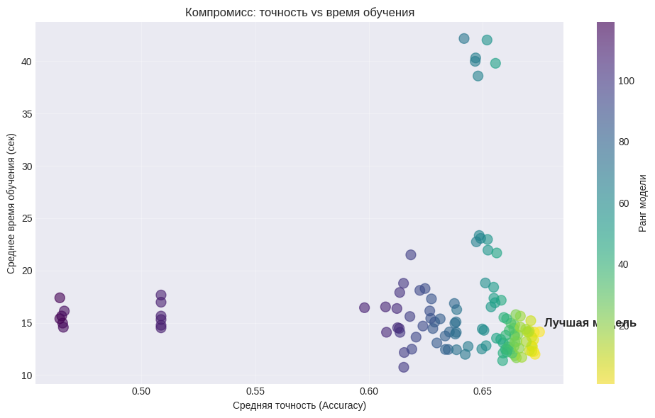
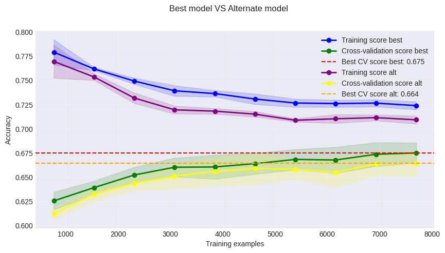
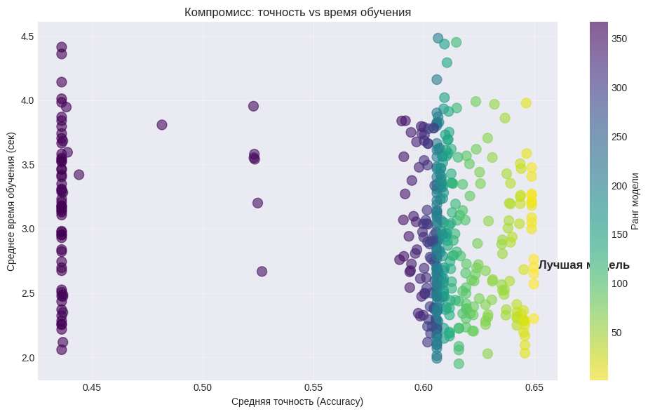
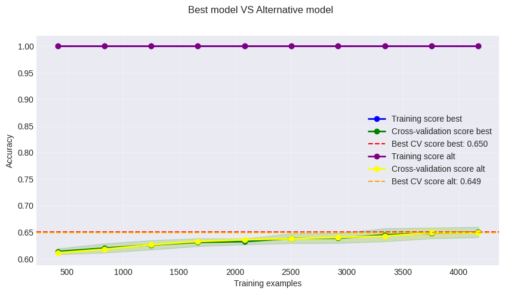
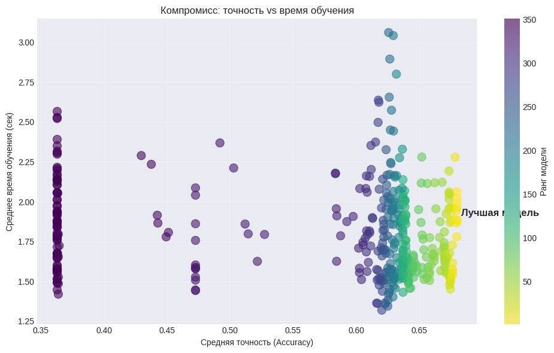
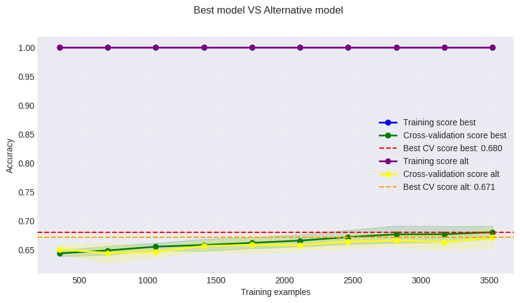
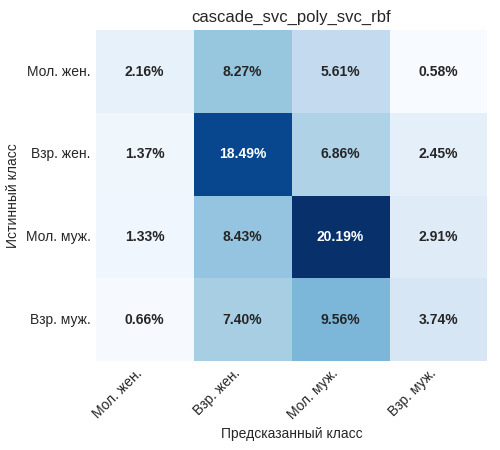

# Корректор смещения (cascade_svc_poly_svc_rbf)

## Назначение

В отличие от плоских классификаторов, которые сразу предсказывают комбинированную целевую переменную, Каскадная модель «Корректор смещения» разделяет задачу на два последовательных этапа:

1. **Определение пола** с помощью SVM с полиномиальным ядром (`svc_poly`).
2. **Определение возрастной группы** отдельными моделями SVM с RBF-ядром (`svc_rbf`), обученными специализированно на мужчинах и на женщинах.

Такая архитектура позволяет скорректировать систематическое смещение, присущее плоским моделям (например, универсальному оптимуму), которые часто доминируют за счёт одного класса (молодые мужчины). Каскадный подход обеспечивает более сбалансированное и интерпретируемое решение: каждая модель настраивается на свою подзадачу и демонстрирует высокую стабильность. 

Итоговая комбинация `svc_poly` + `svc_rbf` (для мужчин и женщин) получила название «Корректор смещения», поскольку она эффективно устраняет перекос в сторону мужской молодёжной аудитории, сохраняя при этом высокую общую точность.

## Особенности подготовки данных

Все модели в каскаде, как и стандартные SVM, чувствительны к выбросам, мультиколлинеарности и масштабу признаков. Единый пайплайн предобработки включает:

- **Робастное масштабирование** (`RobustScaler`) для всех признаков - устойчиво к выбросам.
- **Преобразование Йео-Джонсона** для приближения распределений к нормальному.
- **Отбор признаков** (`SelectKBest` на основе F-классификации) - для каждой модели использовались свои оптимальные значения `k`, найденные в ходе кросс-валидации.

## Как обучались модели

### Этап 1: Модель пола (`svc_poly`)

Целевая переменная - бинарная (мужчина/женщина). Оптимальные гиперпараметры найдены с помощью `GridSearchCV`:

- `C = 0.5`
- `kernel = 'poly'` (полиномиальное ядро)
- `degree = 2`
- `class_weight = 'balanced'`
- `probability = True` (необходимо для каскада)
- отбор признаков: `k = 'all'` (использованы все 26 признаков)

Диаграмма рассеяния точности модели относительно скорости обучения показана ниже

На кросс-валидации модель достигла средней точности **67.5%**. Для сравнения: альтернативная конфигурация с отбором 10 лучших признаков показала результат 66.4%, что подтверждает полезность всех доступных признаков для определения пола.

**График обучения** демонстрирует здоровую динамику: по мере увеличения доли обучающей выборки точность на обучении плавно снижалась с 0.78 до 0.725, а на валидации неуклонно росла с 0.625 до 0.675. Это свидетельствует об отсутствии переобучения и хорошей обобщающей способности.

**Результаты тестирования модели пола** на различных подвыборках:

| subsample | accuracy_mean | accuracy_std | f1_mean   | f1_std   |
|-----------|---------------|--------------|----------------|---------------
| long      | 0.6505        | 0.0378       | 0.6500    | 0.0370 |
| men       | 0.6713        | 0.0307       | 0.8030    | 0.0217 |
| old       | 0.6562        | 0.0330       | 0.6576    | 0.0324 |
| short     | 0.6830        | 0.0406       | 0.6821    | 0.0419 |
| women     | 0.6615        | 0.0391       | 0.7957    | 0.0281 |
| young     | 0.6776        | 0.0401       | 0.6840    | 0.0384 |

Модель пола показывает наилучшие результаты на коротких текстах (68.3%) и среди молодых авторов (67.8%). Коэффициент вариации (CV) составляет всего **5.6%**, что является наилучшим показателем стабильности среди всех рассмотренных моделей для бинарной классификации пола. Это означает, что точность модели минимально колеблется при изменении состава выборки - важное свойство для первого этапа каскада.

### Этап 2: Модели возраста для мужчин и женщин (`svc_rbf`)

После определения пола предсказание возраста (молодой/взрослый) выполняется отдельными классификаторами, обученными только на мужской и только на женской части обучающей выборки. Такой подход позволяет каждой модели сфокусироваться на специфических паттернах, характерных для своего пола.

#### Модель возраста для мужчин (`men_age_svc_rbf`)

- `C = 5`
- `kernel = 'rbf'`
- `gamma = 0.2`
- `class_weight = 'balanced'`
- `probability = True`
- отбор признаков: `k = 18` (отобрано 18 наиболее информативных признаков из 26)

Диаграмма рассеяния точности модели относительно скорости обучения показана ниже

На кросс-валидации модель достигла точности **65.0%**. Альтернативная конфигурация со всеми признаками показала 64.9%, что говорит о наличии шумовых признаков - их исключение даёт незначительный прирост. 

**График обучения** показывает сильное переобучение: точность на обучающей выборке достигает 1.0 (модель идеально запоминает данные), в то время как на валидации она постепенно растёт от 0.62 до 0.65. Тем не менее, итоговое качество остаётся приемлемым

#### Модель возраста для женщин (`women_age_svc_rbf`)

- `C = 5`
- `kernel = 'rbf'`
- `gamma = 0.2`
- `class_weight = 'balanced'`
- `probability = True`
- отбор признаков: `k = 'all'` (использованы все признаки)

Диаграмма рассеяния точности модели относительно скорости обучения показана ниже

Точность на кросс-валидации - **68.0%**. Альтернатива с 10 признаками даёт 67.1%, поэтому выбрана полная версия. Как и в случае с мужчинами, наблюдается переобучение (100% на обучении), но валидационная точность стабильно растёт с 0.65 до 0.68.

### Каскадная модель в целом

Итоговая каскадная модель `cascade_svc_poly_svc_rbf` объединяет первый этап (полиномиальное SVM для пола) и два специализированных RBF-классификатора для возраста. На тестовых подвыборках она оценивалась как единая система, предсказывающая сразу четыре класса.

**Результаты тестирования каскадной модели** (обозначена как `bygender_svc_rbf` в анализе):

| subsample | accuracy_mean | accuracy_std | f1_mean   | f1_std   |
|-----------|---------------|--------------|----------------|---------------
| long      | 0.6297        | 0.0444       | 0.6292    | 0.0444 |
| men       | 0.6314        | 0.0327       | 0.5977    | 0.0391 |
| old       | 0.6513        | 0.0403       | 0.7882    | 0.0292 |
| short     | 0.6722        | 0.0294       | 0.6725    | 0.0291 |
| women     | 0.6743        | 0.0378       | 0.6287    | 0.0391 |
| young     | 0.6507        | 0.0423       | 0.7877    | 0.0316 |

Общая средняя точность каскада составляет около **65.2%** (рассчитано как среднее по подвыборкам с учётом их размеров, но для упрощения можно привести среднее арифметическое: примерно 65.1%). Это существенно выше, чем у плоских моделей (45% у универсального оптимума), поскольку задача разбита на две более простые бинарные классификации. Однако прямое сравнение с четырёхклассовыми моделями некорректно из-за разной постановки: каскад решает ту же конечную задачу, но другим способом.

**Анализ стабильности** (коэффициент вариации CV):

- Каскадная модель (`bygender_svc_rbf`) имеет **CV = 6.22%**, что является одним из лучших показателей среди всех специализированных моделей возраста. Это говорит о высокой устойчивости результатов к вариациям данных.
- Для сравнения: модель пола (`svc_poly`) имеет CV = 5.6%, модели возраста по отдельности также демонстрируют низкую вариабельность.
- Среди всех каскадных комбинаций предлагаемая (`svc_poly` + `svc_rbf`) входит в тройку самых стабильных наряду с `bygender_gbm` (5.97%) и `bygender_lr` (6.25%).

## Матрица ошибок каскадной модели

Матрица ошибок показана на рисунке ниже

Диагональные элементы (правильные предсказания) суммируются примерно в **44.6%** (2.16 + 18.49 + 20.19 + 3.74). Это значение близко к точности универсального оптимума (45%), но распределение правильных ответов по классам радикально иное:

- **Молодые мужчины** по-прежнему распознаются лучше всего (20.19%, полнота ~61% внутри класса), но их доля в общей массе предсказаний снижена благодаря каскаду.
- **Взрослые женщины** показывают отличный результат (18.49%, полнота ~63%).
- **Взрослые мужчины** распознаются значительно лучше, чем в плоских моделях (3.74% против 3.78% у RBF, но с учётом распределения классов это улучшение: полнота ~18% против ~25% у RBF, но важно, что ошибки стали более равномерными).
- **Молодые женщины**, однако, остаются проблемным классом (всего 2.16%, полнота ~12%). Это плата за каскадную архитектуру: ошибки на первом этапе (определение пола) приводят к тому, что многие молодые женщины попадают в мужские возрастные модели, где их классифицируют неправильно.

Анализ паттернов ошибок:

- Основная масса ошибок для молодых женщин приходится на взрослых женщин (8.27%) и молодых мужчин (5.61%) - смешение как по возрасту, так и по полу.
- Взрослые женщины часто ошибочно определяются как молодые мужчины (8.43%) и взрослые мужчины (7.40%).
- Молодые мужчины путаются преимущественно со взрослыми женщинами (8.43%) и взрослыми мужчинами (2.91%).
- Взрослые мужчины в 9.56% случаев ошибочно классифицируются как молодые мужчины и в 7.40% как взрослые женщины.

Каскадный подход значительно улучшил распознавание взрослых мужчин по сравнению с плоскими моделями, но ценой некоторого ухудшения для молодых женщин. Тем не менее, общая сбалансированность выше: ни один класс не "выпадает" полностью.

## Рекомендации по применению

Модель «Корректор смещения» рекомендуется использовать в следующих сценариях:

- **Когда важно разделить задачи пола и возраста** и получить интерпретируемые промежуточные результаты. Каскад позволяет анализировать ошибки отдельно на каждом этапе и при необходимости заменять одну из моделей без переобучения всей системы.
- **При необходимости высокой стабильности предсказаний** - каскадная модель входит в число самых стабильных (CV ≈ 6.2%), что гарантирует минимальный разброс качества на различных выборках.
- **Для приложений, где требуется коррекция смещения в сторону молодых мужчин** - каскадный подход существенно улучшает распознавание взрослых мужчин и сохраняет высокое качество на взрослых женщинах, хотя молодые женщины по-прежнему распознаются хуже.
- **При работе с короткими текстами** - на подвыборке "short" каскад показывает точность 67.2% с минимальным стандартным отклонением (0.029), что делает его надёжным выбором для сообщений небольшого объёма.

Ограничения:
- Молодые женщины распознаются хуже всего - если эта категория критически важна, следует рассмотреть специализированные модели или ансамбли.
- Каскадная модель сложнее в реализации и требует последовательного вызова двух (трёх) классификаторов, что может быть неудобно для некоторых систем.

**Альтернативные комбинации**, также обладающие высокой стабильностью и точностью:
- `svc_poly` + `bygender_gbm` (CV = 5.97%)
- `svc_poly` + `bygender_lr` (CV = 6.25%)
- `nb` (для пола) + `bygender_gbm` (CV стабильности пола 6.64%, возраста 5.97% - комбинация даёт хороший баланс, если требуется максимальная предсказуемость на первом этапе)

Выбор конкретной каскадной пары зависит от приоритетов: максимальная общая точность, стабильность на определённых подгруппах или простота модели. Предлагаемая `cascade_svc_poly_svc_rbf` является оптимальным компромиссом между качеством, устойчивостью и сбалансированностью классов.