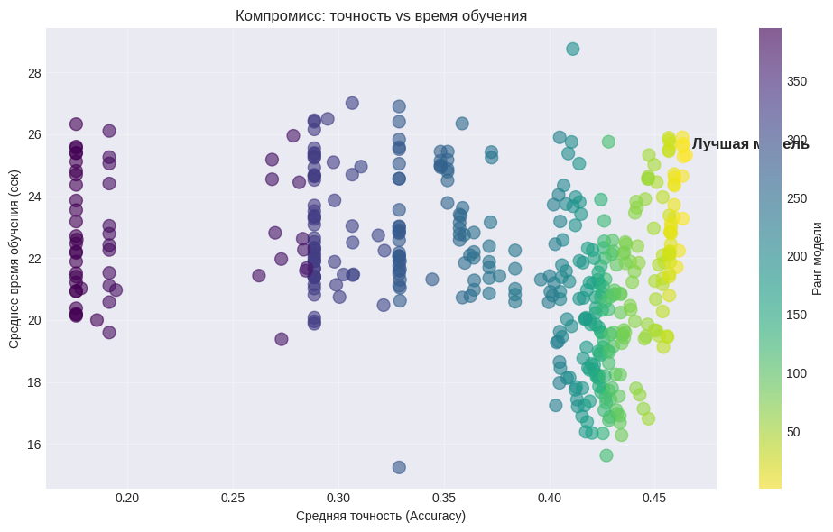
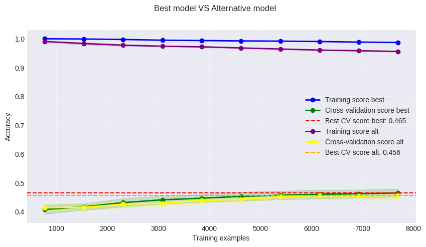
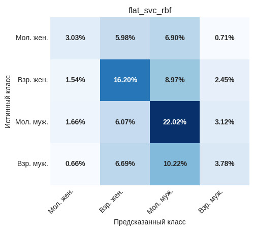

# Универсальный оптимум (flat_svc_rbf)

## Назначение

Модель «Универсальный оптимум» представляет собой плоский классификатор на основе метода опорных векторов с радиальным базисным ядром (RBF), который одновременно предсказывает пол и возраст автора текста, объединяя их в четыре возможные категории:  
- молодая женщина,  
- взрослая женщина,  
- молодой мужчина,  
- взрослый мужчина.

Это базовая рекомендуемая модель для большинства практических сценариев, когда требуется получить максимальную общую точность на разнородных текстах без дополнительных требований к балансу классов. Она наилучшим образом работает на мужской аудитории, молодых авторах и коротких текстах, демонстрируя стабильные результаты на всех типах данных.

## Особенности подготовки данных

Модель чувствительна к выбросам, мультиколлинеарности и масштабу признаков, поэтому этап предобработки включает:

- **Робастное масштабирование** (`RobustScaler`) для всех признаков – устойчиво к выбросам.  
- **Преобразование Йео–Джонсона** для приближения распределений к нормальному.  
- **Отбор признаков** с помощью `SelectKBest` (F-классификация) на каждом фолде кросс-валидации.

## Как обучалась модель

Целевая переменная формировалась как комбинация пола и возраста:  
`gender * 2 + age` (0 – молодая женщина, 1 – взрослая женщина, 2 – молодой мужчина, 3 – взрослый мужчина).

Оптимальные гиперпараметры найдены с помощью `GridSearchCV`:

- `C = 1` (штраф)  
- `gamma = 0.2` (коэффициент ядра RBF)  
- `kernel = 'rbf'`  
- `class_weight = 'balanced'`  
- отбор признаков: использовать **все** (`k = 'all'`).

Диаграмма рассеяния точности модели относительно скорости обучения показана ниже

На кросс-валидации (5 фолдов) модель достигла средней точности **46.5%**, что существенно выше случайного угадывания (25%) и превышает наивный базовый уровень (32.9%). 

Для оценки влияния отбора признаков была обучена модель с теми же гиперпараметрами, но с ограничением k = 16. На графике ниже приведено сравнение динамик точности на обучающей и валидационной выборках в процессе последовательного добавления фолдов обучения.

Обе конфигурации демонстрируют выраженное переобучение на начальных этапах, однако по мере увеличения числа фолдов точность на валидации растет, а разрыв с обучающей кривой сокращается. Модель, использующая все доступные признаки (k = 'all'), стабильно превосходит альтернативную конфигурацию: на поздних фолдах её точность достигает 0,465, что примерно на 1 процентный пункт выше, чем у модели с отбором 16 признаков. Это свидетельствует о том, что даже слабые признаки в совокупности вносят полезный вклад и их исключение приводит к потере прогностической силы.

## Результаты тестирования

| subsample | accuracy_mean | accuracy_std | f1_mean   | f1_std   |
|-----------|---------------|--------------|----------------|---------------
| long      | 0.433      | 0.038     | 0.367  | 0.041 |
| men       | 0.475      | 0.032     | 0.514  | 0.028 |
| old       | 0.395      | 0.033     | 0.474  | 0.033 |
| short     | 0.466      | 0.044     | 0.455  | 0.046 |
| women     | 0.420      | 0.034     | 0.505  | 0.038 |
| young     | 0.506      | 0.046     | 0.568  | 0.052 |

На общей выборке модель показывает **45.0% точности**, **F1 = 0.420** и **CV=11.71**, лидируя среди всех рассмотренных подходов на большинстве подвыборок:

- лучшая среди мужчин,  
- лучшая среди молодых авторов,  
- лучшая на коротких текстах.

Стандартное отклонение точности на разных фолдах составляет около 0.047, что свидетельствует об умеренной стабильности и хорошей обобщающей способности. Модель можно считать надёжным выбором для приложений, где важен баланс точности и устойчивости.

Матрица ошибок показана на рисунке ниже

Матрица ошибок наглядно демонстрирует сильные и слабые стороны модели «Универсальный оптимум». Диагональные элементы (правильные предсказания) составляют в сумме около 45%, что согласуется с заявленной точностью. Однако распределение правильных ответов по классам крайне неравномерно:

- Молодые мужчины распознаются лучше всего (22,02% от общего числа наблюдений, полнота около 67% внутри класса). Это доминирующий класс, на котором модель фокусируется.
- Взрослые женщины показывают средний результат (16,20%, полнота ~56%).
- Взрослые мужчины и молодые женщины распознаются существенно хуже (3,78% и 3,03% соответственно, полнота ~25% и ~18%).

Основные паттерны ошибок:
- Молодые женщины часто путаются с молодыми мужчинами (6,9%) и взрослыми женщинами (5,98%) - возрастная и гендерная границы размыты.
- Взрослые женщины ошибочно классифицируются как молодые мужчины (8,97%) и молодые женщины (5,98%).
- Молодые мужчины в заметной части случаев попадают в категорию взрослых мужчин (3,12%) и взрослых женщин (6,07%).
- Взрослые мужчины преимущественно ошибочно определяются как молодые мужчины (10,22%) - почти две трети ошибок этого класса.

## Рекомендации по применению
Эта модель рекомендуется в качестве основного решения, если:
- Требуется максимальная общая точность на разнородной выборке без дополнительных условий. Модель лидирует по accuracy и F1-мере на общем массиве данных.
- Преобладают **короткие тексты** или **аудитория** преимущественно **мужская и молодая** - на этих подвыборках модель показывает наилучшие результаты.
- Допустимо некоторое смещение в сторону доминирующих групп (**молодых мужчин**) в обмен на более высокую среднюю точность.

Ограничения: модель хуже распознаёт взрослых мужчин и молодых женщин, поэтому в задачах, где **важна равномерная классификация** всех четырёх групп, **следует рассмотреть альтернативы**.
